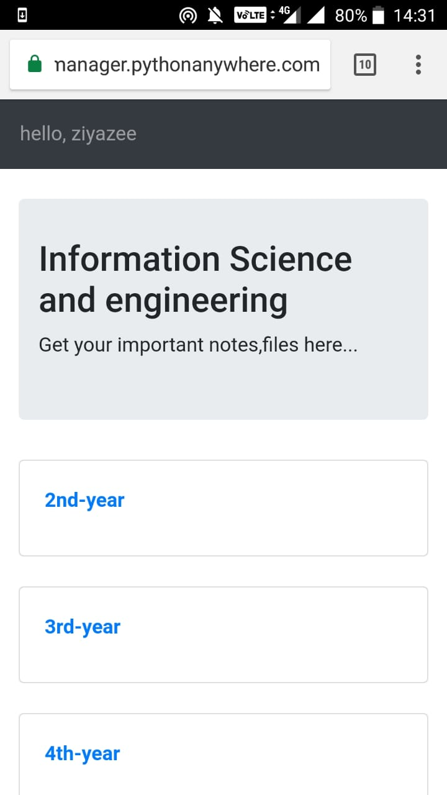
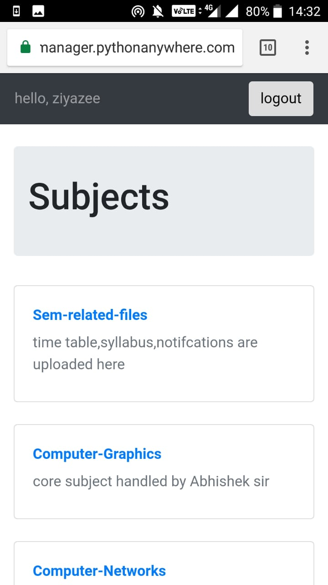
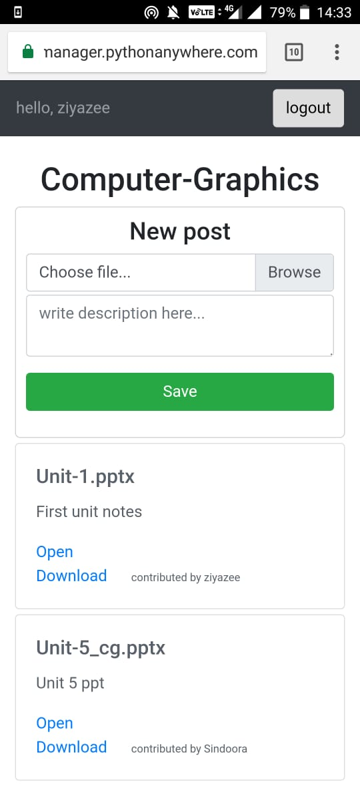

## Running live here:
[https://www.isefilemanager.com](https://isefilemanager.pythonanywhere.com)

#### login:
username: User  
password: bcda4321

___

### Steps to run this repo in your terminal

##### 1. Installations
* python3  
* django  
* django-cleanup

##### 2. Clone the project

git clone https://www.github.com/ziyazee/ise-important-files

cd ise-important-files/

##### 3. Run the project

python manage.py runserver

___

### Some snapshots of this project:

